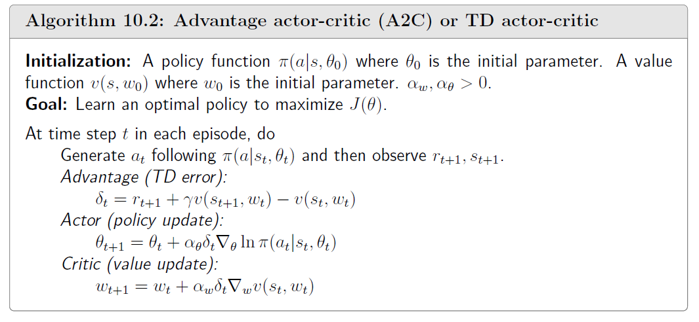

    while not done:
        action = agent.take_action(state)
        next_state, reward, done, _, _  = env.step(action)
        # 保存每个时刻的状态\动作\...
        transition_dict['states'].append(state)
        transition_dict['actions'].append(action)
        transition_dict['next_states'].append(next_state)
        transition_dict['rewards'].append(reward)
        transition_dict['dones'].append(done)
        # 更新状态
        state = next_state
        # 累计回合奖励
        episode_return += reward

while not done的目标是收集经验，经验保存在transition_dict中
agent.take_action(state):根据策略选择最优的动作

PolicyNet：输入state，输出概率向量
对应成员变量actor

ValueNet ：输入state，输出state value的值
对应成员变量critic