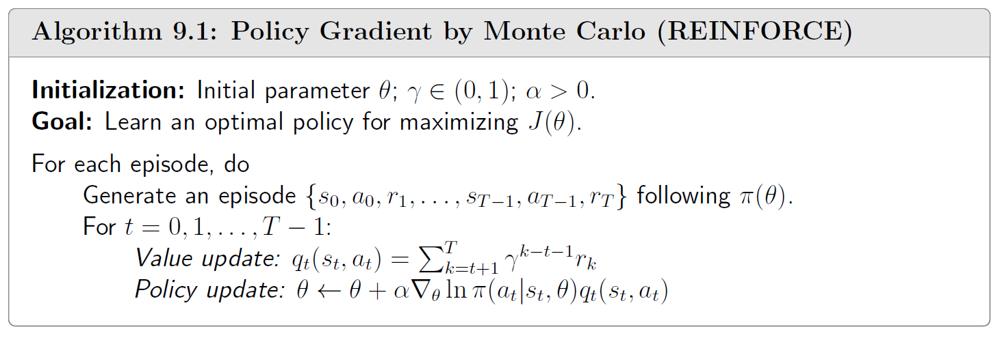

Policy Gradient by Monte Carlo(REINFORCE)：

while not done : 生成episode

调用 loss.backward() 后，计算出的梯度会被存储在模型参数的 .grad 属性中。
如果多次调用 backward() 而不清除梯度，梯度会不断累加。
因此，在调用 loss.backward() 之前，通常会调用 self.optimizer.zero_grad() 清零之前的梯度。

self.optimizer.step() 会根据这些梯度和预设的优化算法（例如 Adam、SGD 等），利用每个参数的梯度逐步更新模型的参数。